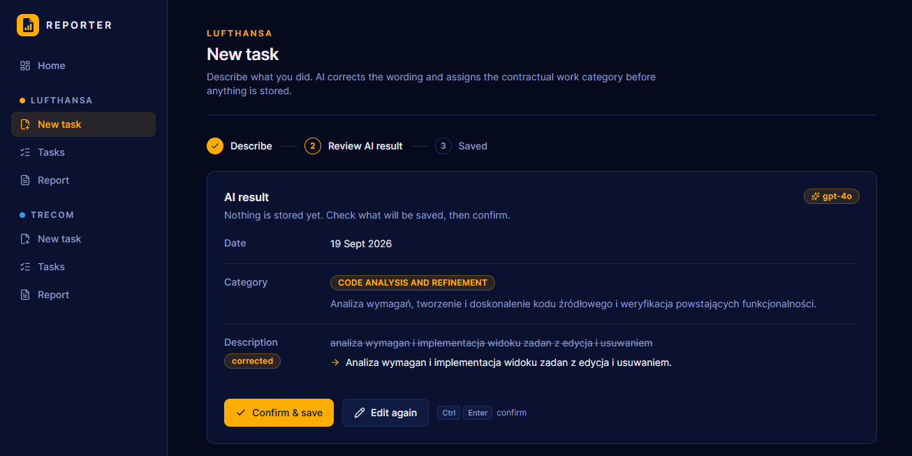
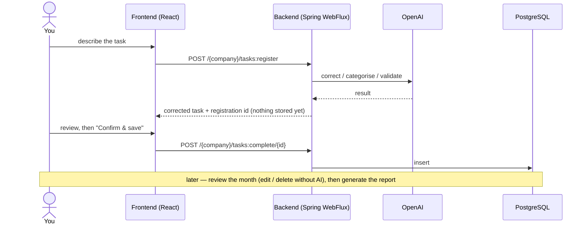
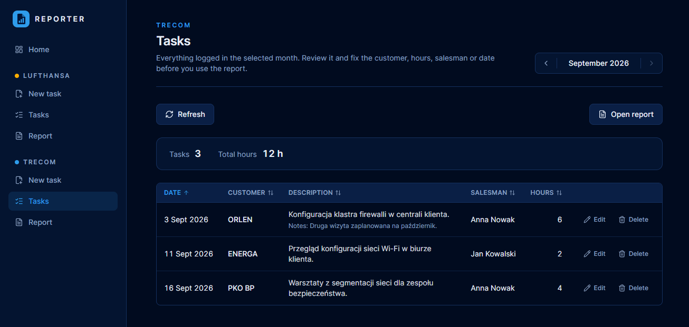
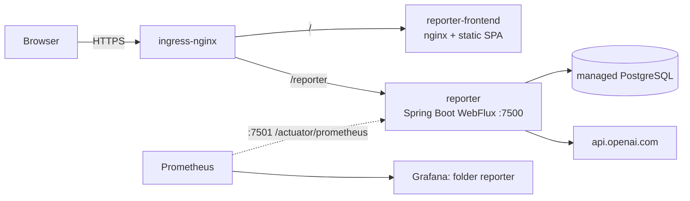

# Reporter Application

[](https://github.com/magikabdul/activity-reporter/actions/workflows/ci.yaml)
[](https://sonarcloud.io/summary/new_code?id=magikabdul_activity-reporter)
[](https://sonarcloud.io/summary/new_code?id=magikabdul_activity-reporter)


[](https://hub.docker.com/r/magikabdul/reporter/tags)
[](https://hub.docker.com/r/magikabdul/reporter-frontend/tags)

---


[](https://sonarcloud.io/summary/new_code?id=magikabdul_activity-reporter)
[](https://sonarcloud.io/summary/new_code?id=magikabdul_activity-reporter)


---

# Description

Reporter is a personal work log for a contractor who works for two clients, **Lufthansa** and **Trecom**, and has to
hand in a monthly description of the work done to each of them.

You type what you did in plain (Polish) language. OpenAI (`gpt-4o`) cleans the text up and — depending on the client —
either assigns one of the contractual work categories or validates the customer-facing details. You check the result,
confirm it, and only then is it stored. At the end of the month the application produces the report each client expects.

| | Lufthansa | Trecom |
|---|---|---|
| What you enter | a description, optionally the date | customer, description, hours spent, salesman, optional notes and date |
| What AI does | corrects the wording and picks one of **7 contractual work categories** | checks that the salesman's first and last name are real names, corrects the description and the notes |
| Monthly report | **AI-written summary per category** (one paragraph each, ready for the invoice annex) | plain listing of every task with hours, plus totals per customer and per salesman |



## How it works



- **Two steps on purpose.** `register` keeps the task in memory only; `complete` persists it. What AI produced never
  reaches the database without you having seen it. "Edit again" simply abandons the registration.
- **Review before reporting.** The *Tasks* page lists everything saved in a month. Corrections are manual (no AI, so it
  cannot overwrite your fix) and deleting asks for confirmation.
- **The Lufthansa report costs OpenAI calls** (one per category), so it is generated only when you ask for it and cached
  in the browser. If a task of that month changes afterwards, the cached report is flagged as out of date.
- Task dates are calendar days in `Europe/Warsaw`, whatever clock the container runs on.



## Architecture



Both parts are served from one host, so the API is same-origin and the backend needs no CORS configuration. There is no
authentication: the application is meant for a single user inside a private network.

| Part | Stack |
|---|---|
| Backend (repo root) | Java 21, Spring Boot 4.1 (WebFlux), Spring Data R2DBC + PostgreSQL, Flyway, Spring AI (OpenAI), MapStruct, Lombok, Gradle |
| Frontend (`frontend/`) | React 19, TypeScript, Vite, Tailwind CSS v4, TanStack Query, react-hook-form + zod, Vitest |
| Runtime | Kubernetes, ingress-nginx, cert-manager (Let's Encrypt), images on Docker Hub |

## API at a glance

Base path `/reporter`. Full reference with every field, validation rule and error: **[docs/backend-api.md](docs/backend-api.md)**.

| Endpoint (both `lufthansa` and `trecom`) | Purpose |
|---|---|
| `POST /{company}/tasks:register` | run AI on the input, return the result and a registration id — nothing is stored |
| `POST /{company}/tasks:complete/{registrationId}` | persist the registered task |
| `GET /{company}/tasks?year=&month=` | stored tasks of a month (`200 []` when empty) |
| `PUT /{company}/tasks/{id}` | manual correction, no AI |
| `DELETE /{company}/tasks/{id}` | delete (`204`) |
| `GET /{company}/report?year=&month=` | monthly report (`404` without a body when the month is empty) |

Errors are JSON `{status, title, description}`. A registration that AI rejects (unclassifiable task, not a real name)
answers `404` **with** a body; validation problems answer `400`.

## Running locally

**Backend** — JDK 21:

```bash
./gradlew clean build                                     # compile + tests
./gradlew bootRun                                         # needs the environment variables below
./gradlew bootRun --args='--spring.flyway.enabled=false'  # smoke start without a database
```

| Variable | Meaning |
|---|---|
| `database-host`, `database-port`, `database-name`, `database-user`, `database-password` | PostgreSQL (R2DBC, TLS required) |
| `flyway-url` | JDBC URL of the same database, used by Flyway for migrations |
| `OPENAI_API_KEY` | OpenAI API key |
| `reporter.time-zone` *(optional)* | time zone of task dates, default `Europe/Warsaw` |

The API listens on `:7500`, the actuator (health probes, Prometheus metrics) on its own port `:7501`.

**Frontend** — Node 24:

```bash
cd frontend
npm ci
npm run dev        # http://localhost:5173, proxies /reporter to VITE_API_PROXY (see .env.example)
npm run lint && npm run typecheck && npm test && npm run build
```

## Releases and deployment

Backend and frontend are versioned and released independently, each by a manually started GitHub Actions workflow
(*patch / minor / major*):

| | Workflow | Tag | Image |
|---|---|---|---|
| Backend | `Release` | `vX.Y.Z` | `magikabdul/reporter` |
| Frontend | `Frontend Release` | `frontend-vX.Y.Z` | `magikabdul/reporter-frontend` |

Kubernetes manifests live in `k8s/` — `namespace.yaml`, `backend/` (deployment, service, ingress) and `frontend/`
(deployment, service, TLS ingress, certificate) — and are applied by hand; CI does not deploy. Rollouts are zero-downtime with a single replica: a `preStop`
sleep keeps the old pod serving until the ingress has dropped it, then in-flight requests are allowed to finish.

Monitoring (Grafana dashboards *Reporter / Overview · Runtime · Logs* and alert rules) is part of the cluster's
monitoring stack in a separate repository; the backend pod is annotated for Prometheus scraping.

## Documentation

| Document | Content |
|---|---|
| [docs/backend-api.md](docs/backend-api.md) | API reference: DTOs, validation, error format, database schema |
| [CLAUDE.md](CLAUDE.md) | project guide: package layout, behaviour worth knowing, commands, Kubernetes and monitoring notes |
| [frontend/CLAUDE.md](frontend/CLAUDE.md) | frontend guide: structure, styling rules (design tokens, per-company palettes), behaviour, deployment |
